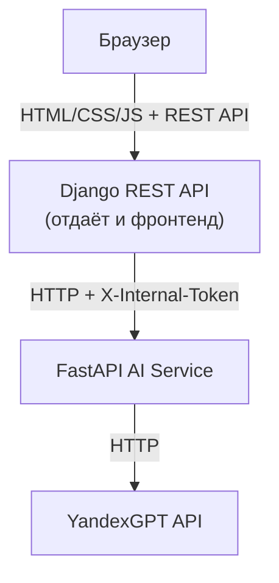

# Smart Notes AI

Smart Notes AI — веб-приложение для суммаризации текстовых заметок с использованием искусственного интеллекта.

Пользователь регистрируется, отправляет текст и получает его краткое содержание, сгенерированное AI-моделью. История всех запросов сохраняется и доступна только их автору.

Проект — учебная практика JWT-аутентификации, REST API на Django и взаимодействия между сервисами.

---

# Возможности

* суммаризация текста с использованием YandexGPT
* регистрация и вход по email/паролю (JWT: access + refresh, автообновление токена на фронте)
* персональная история запросов — каждый пользователь видит только свою
* REST API на Django REST Framework
* отдельный AI-сервис на FastAPI, изолированный внутренним токеном
* минималистичный монохромный интерфейс без сторонних UI-фреймворков

---

# Архитектура

Проект состоит из двух сервисов:

* **Django Backend** — отдаёт REST API (аутентификация, история, проксирование к AI-сервису) **и** сам интерфейс (шаблон + статика), отдельного frontend-сервиса сейчас нет.
* **AI Service (FastAPI)** — принимает текст от Django по внутреннему токену, обращается к YandexGPT, возвращает результат.



> Раньше в проекте была отдельная папка `frontend/` под связку Nginx + статика в третьем контейнере. Сейчас страница отдаётся напрямую Django-шаблоном (`backend/templates/`, `backend/static/`), поэтому в схеме её нет. Если понадобится вынести фронт обратно за Nginx — понадобится убрать Django template-теги (``) из `index.html` и вернуть обычные относительные пути.

---

# Технологический стек

Backend

* Python, Django, Django REST Framework
* JWT-аутентификация (`djangorestframework-simplejwt`, с blacklist для refresh-токенов)

AI-сервис

* FastAPI, Uvicorn, httpx

Frontend

* HTML, CSS, JavaScript (Fetch API) — отдаётся Django-шаблоном, без сборки

Инфраструктура

* Docker, Docker Compose
* SQLite (может быть заменена на PostgreSQL)

---

# API endpoints

Аутентификация

```
POST /api/users/register/
POST /api/token/
POST /api/token/refresh/
```

AI

```
POST /api/ai/summarize/
GET  /api/ai/history/
```

Служебное

```
GET /api/health/
```

---

# Запуск проекта

## Локально (без Docker)

Понадобятся два запущенных процесса одновременно — AI-сервис и Django.

1. Создать файл `.env` **в корне проекта** (`smart_notes/.env`, на уровень выше и `backend/`, и `ai_service/` — оба сервиса читают именно его):

   ```
   YANDEX_API_KEY=ключ_без_кавычек
   YANDEX_FOLDER_ID=id_без_кавычек
   INTERNAL_API_TOKEN=любая_общая_строка
   SECRET_KEY=django_secret_key
   ```

   `YANDEX_API_KEY` и `YANDEX_FOLDER_ID` — в [Yandex Cloud](https://yandex.cloud/ru).
   `INTERNAL_API_TOKEN` должен быть **одинаковым** для `backend` и `ai_service` — это общий секрет между ними, не связан с JWT пользователя.

2. Запустить AI-сервис:

   ```powershell
   cd ai_service
   uvicorn app.main:app --host 0.0.0.0 --port 8001
   ```

3. В отдельном терминале — Django (сначала применить миграции, один раз):

   ```powershell
   cd backend
   py manage.py migrate
   py manage.py runserver
   ```

4. Открыть в браузере: `http://127.0.0.1:8000/`

## Через Docker

```
git clone https://github.com/vss0987/smart-notes
cd smart-notes
```

Тот же `.env` в корне, что и выше.

```
docker-compose up --build
```

> Docker-конфигурация в проекте пока не пересобиралась под текущую архитектуру (два сервиса вместо трёх, фронт отдаёт сам Django) — перед использованием стоит обновить `docker-compose.yml` и `Dockerfile` соответственно.

---

# Цели проекта

Проект — практика:

* REST API на Django REST Framework
* JWT-аутентификации (access/refresh, ротация, blacklist)
* интеграции с внешним AI-провайдером через отдельный сервис
* разграничения доступа к данным на уровне queryset (история — только своя)
* контейнеризации приложений с помощью Docker
